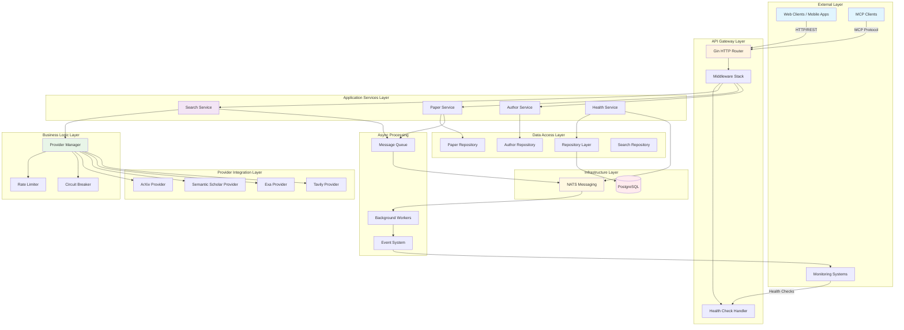
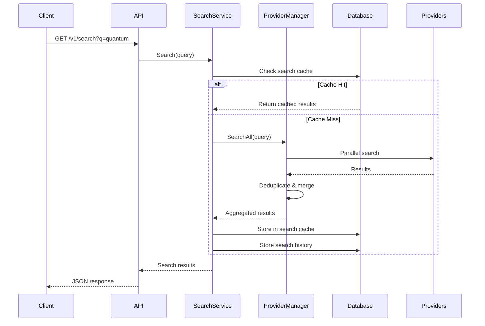
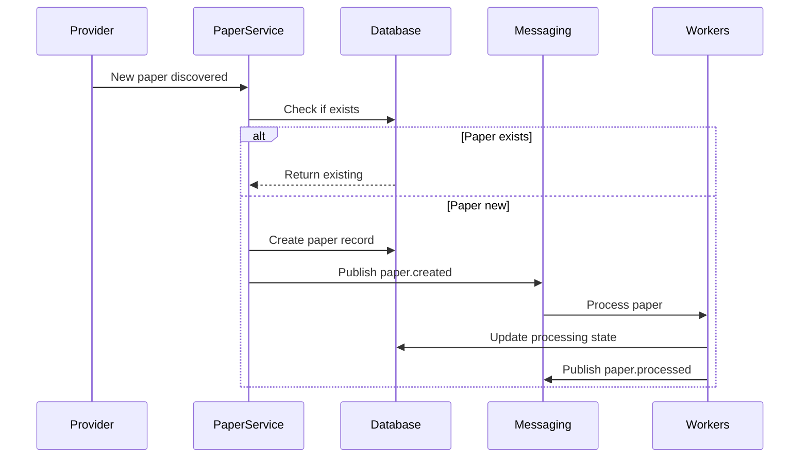
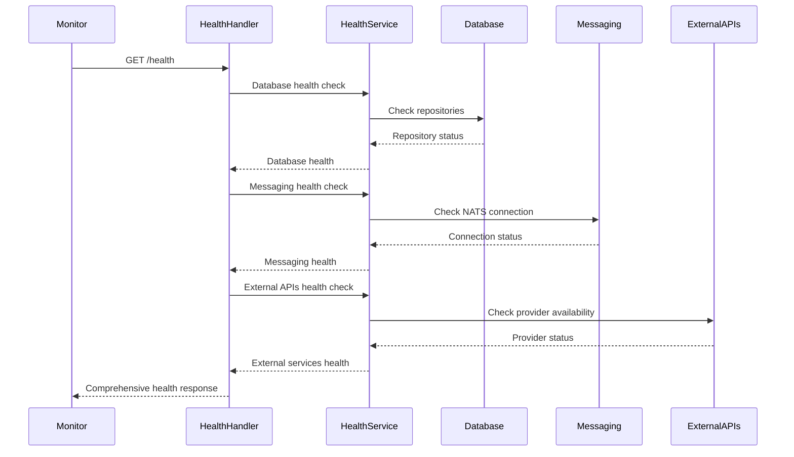

# SciFind Backend Architecture Documentation

## System Overview

SciFind is a Go-based research paper aggregation and search platform that provides unified access to multiple academic data sources through a RESTful API. The system is designed with a layered architecture pattern, emphasizing modularity, scalability, and maintainability.

## Architecture Diagram

## Design Principles

### 1. **Layered Architecture**
- **Clear separation of concerns** between API, business logic, and data layers
- **Dependency inversion** with interfaces defining contracts between layers
- **Testability** through dependency injection and mock implementations

### 2. **Microservice-Ready Design**
- **Service boundaries** are clearly defined with single responsibilities
- **Loose coupling** between components through interfaces and messaging
- **Independent scalability** of different system components

### 3. **Resilience Patterns**
- **Circuit breakers** for external provider failures
- **Rate limiting** to prevent abuse and ensure fair usage
- **Retry mechanisms** with exponential backoff
- **Graceful degradation** when providers are unavailable

### 4. **Observability First**
- **Structured logging** throughout the system
- **Health checks** for all critical components
- **Metrics collection** for performance monitoring
- **Distributed tracing** for request flow analysis

## Component Architecture

### API Layer

#### [`internal/api/router.go`](internal/api/router.go:14)
The API layer uses **Gin** as the HTTP framework with a clean routing structure:
- **RESTful endpoints** organized by resource type
- **Middleware pipeline** for cross-cutting concerns
- **Versioned API** (`/v1/`) for backward compatibility
- **MCP protocol support** for AI assistant integration

**Key Components:**
- **Router**: Central routing configuration
- **Middleware**: Request ID, CORS, security headers, logging
- **Handlers**: Request/response mapping and validation
- **Error Handling**: Consistent error responses

### Service Layer

#### [`internal/services/search_service.go`](internal/services/search_service.go)
**Search Service** orchestrates paper discovery across multiple providers:
- **Query processing** and validation
- **Provider selection** based on configuration
- **Result aggregation** with deduplication
- **Database caching** for performance optimization

#### [`internal/services/paper_service.go`](internal/services/paper_service.go)
**Paper Service** manages paper lifecycle:
- **CRUD operations** for paper metadata
- **Processing state management**
- **Author relationship management**
- **Category classification**

#### [`internal/services/author_service.go`](internal/services/author_service.go)
**Author Service** handles author information:
- **Author profile management**
- **Paper-author relationships**
- **Citation metrics calculation**
- **Affiliation tracking**

#### [`internal/services/health_service.go`](internal/services/health_service.go)
**Health Service** provides comprehensive health monitoring for application components:
- **Database connectivity** checks for PostgreSQL
- **Messaging system** health for NATS
- **External API providers** availability monitoring
- **System resource** utilization tracking
- **Memory and runtime** statistics collection

### Provider Integration Layer

#### [`internal/providers/manager.go`](internal/providers/manager.go:15)
**Provider Manager** abstracts external data sources:
- **Provider registration** and lifecycle management
- **Search orchestration** across multiple providers
- **Result aggregation** with configurable strategies
- **Health monitoring** and failover handling

**Supported Providers:**
- **ArXiv**: Preprint repository with physics, math, CS papers
- **Semantic Scholar**: Academic paper database with citations
- **Exa**: AI-powered search with semantic understanding
- **Tavily**: Real-time web search with academic focus

**Aggregation Strategies:**
- **Merge**: Combine results from all providers
- **First**: Return first successful result
- **Fastest**: Return fastest provider's result
- **Best Quality**: Select highest quality results
- **Round Robin**: Distribute load across providers

### Data Persistence Layer

#### [`internal/repository/database.go`](internal/repository/database.go:20)
**Database Layer** provides data persistence:
- **PostgreSQL** for primary data storage
- **SQLite** for development/testing
- **GORM ORM** for database abstraction
- **Migration system** for schema management

**Key Entities:**
- **Paper**: Research paper metadata
- **Author**: Author information and relationships
- **Category**: Academic subject classifications
- **SearchHistory**: Query tracking for analytics
- **SearchCache**: Result caching for performance

### Messaging System

#### [`internal/messaging/manager.go`](internal/messaging/manager.go:15)
**Messaging Layer** enables asynchronous processing:
- **NATS JetStream** for message queuing
- **Event-driven architecture** for loose coupling
- **Background processing** for heavy operations
- **System notifications** for monitoring

**Event Types:**
- **Search Events**: Query processing and completion
- **Paper Events**: Processing state changes
- **Health Events**: System health monitoring
- **Analytics Events**: Usage tracking

## Data Flow Patterns

### 1. Search Flow

### 2. Paper Processing Flow

### 3. Health Monitoring Flow

## Integration Points

### External Provider APIs
- **ArXiv API**: RESTful XML-based API
- **Semantic Scholar**: GraphQL and REST APIs
- **Exa API**: RESTful JSON API with semantic search
- **Tavily API**: RESTful JSON API with real-time search

### Internal Service Communication
- **HTTP/REST**: Primary API communication
- **NATS Messaging**: Asynchronous event processing
- **Database**: Synchronous data access
- **Database Caching**: Search result caching

### Monitoring Integrations
- **Prometheus**: Metrics collection
- **Grafana**: Visualization dashboards
- **Jaeger**: Distributed tracing
- **ELK Stack**: Log aggregation

## Scalability Considerations

### Horizontal Scaling
- **Stateless services**: Easy horizontal scaling
- **Load balancing**: Distribute requests across instances
- **Database sharding**: Partition data by provider or category
- **Database optimization**: Connection pooling and query optimization

### Vertical Scaling
- **Resource optimization**: Efficient Go runtime
- **Connection pooling**: Database and HTTP connections
- **Memory management**: Efficient data structures
- **CPU optimization**: Concurrent processing

### Auto-scaling Triggers
- **Request volume**: Scale based on QPS
- **Response time**: Scale when latency increases
- **Error rate**: Scale when error rates spike
- **Resource usage**: Scale based on CPU/memory

## Security Architecture

### Authentication & Authorization
- **API Key authentication**: Simple key-based access
- **Rate limiting**: Per-key usage limits
- **IP whitelisting**: Restrict access by IP
- **JWT tokens**: For future user authentication

### Data Protection
- **Encryption in transit**: TLS 1.3 for all communications
- **Encryption at rest**: Database encryption
- **PII handling**: Minimal personal data collection
- **Data retention**: Configurable retention policies

### API Security
- **Input validation**: Strict validation of all inputs
- **SQL injection prevention**: Parameterized queries
- **XSS prevention**: Output encoding
- **Rate limiting**: Per-endpoint rate limits

### Provider Security
- **API key management**: Secure storage of provider keys
- **Request signing**: HMAC signatures for sensitive operations
- **IP restrictions**: Restrict provider access
- **Audit logging**: Track all provider interactions

## Deployment Architecture

### Container Strategy
- **Docker containers**: Consistent deployment units
- **Multi-stage builds**: Optimized image sizes
- **Health checks**: Container health monitoring
- **Resource limits**: CPU/memory constraints

### Orchestration
- **Kubernetes**: Container orchestration
- **Service mesh**: Istio for service communication
- **Ingress controllers**: NGINX for external traffic
- **Config maps**: External configuration management

### Environment Strategy
- **Development**: Local Docker Compose
- **Staging**: Kubernetes cluster with test data
- **Production**: Multi-region Kubernetes with load balancing

### CI/CD Pipeline
- **GitHub Actions**: Automated testing and deployment
- **Container registry**: Docker Hub or AWS ECR
- **Blue-green deployment**: Zero-downtime deployments
- **Rollback strategy**: Quick rollback capabilities

### Infrastructure as Code
- **Terraform**: Infrastructure provisioning
- **Helm charts**: Kubernetes deployment templates
- **Ansible**: Configuration management
- **Monitoring setup**: Automated monitoring deployment

## Performance Optimization

### Database Caching Strategy
- **Query result caching**: Store search results in database
- **Cache invalidation**: TTL and event-based invalidation
- **Cache warming**: Pre-populate popular searches
- **Database indexing**: Optimized indexes for fast queries

### Database Optimization
- **Query optimization**: Indexed columns and query tuning
- **Connection pooling**: Efficient database connections
- **Read replicas**: Scale read operations
- **Batch operations**: Reduce database round-trips

### Provider Optimization
- **Parallel requests**: Concurrent provider calls
- **Request batching**: Group similar requests
- **Response caching**: Cache provider responses
- **Fallback strategies**: Graceful degradation

## Monitoring & Observability

### Metrics Collection
- **Application metrics**: Request rates, response times, error rates
- **Business metrics**: Search volume, paper views, provider usage
- **Infrastructure metrics**: CPU, memory, disk, network
- **Provider metrics**: API usage, response times, error rates

### Alerting Strategy
- **SLA monitoring**: Response time and availability
- **Error rate thresholds**: Immediate alerts for high error rates
- **Resource exhaustion**: Proactive scaling alerts
- **Provider issues**: Immediate notification of provider failures

### Logging Strategy
- **Structured logging**: JSON format with consistent fields
- **Log levels**: Debug, info, warn, error with dynamic adjustment
- **Correlation IDs**: Track requests across services
- **Security logging**: Audit trails for sensitive operations

## Future Considerations

### Planned Enhancements
- **User authentication**: Full user management system
- **Personalization**: Personalized search results
- **Machine learning**: AI-powered recommendations
- **Real-time updates**: WebSocket notifications

### Technology Evolution
- **GraphQL API**: Alternative to REST for complex queries
- **gRPC services**: High-performance internal communication
- **Event sourcing**: Complete audit trail of changes
- **CQRS**: Separate read and write models

### Scaling Roadmap
- **Multi-region deployment**: Global availability
- **CDN integration**: Static asset caching
- **Edge computing**: Processing closer to users
- **Microservices split**: Further service decomposition

---

*This architecture document is a living document that should be updated as the system evolves. For questions or suggestions, please refer to the project's contribution guidelines.*