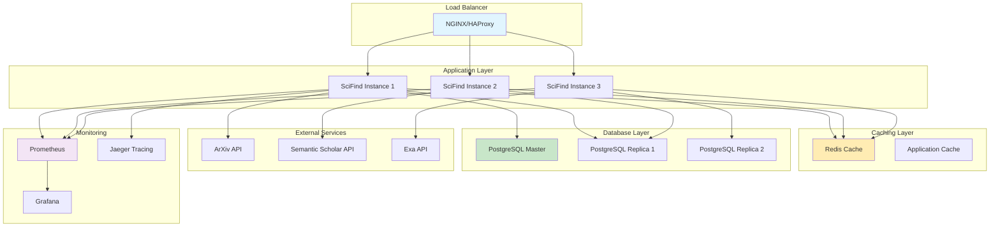

# SciFind Backend Performance Guide

Comprehensive performance optimization guides, monitoring setup, and best practices for the SciFind backend.

## Table of Contents
- [Performance Overview](#performance-overview)
- [Monitoring & Metrics](#monitoring--metrics)
- [Application Optimization](#application-optimization)
- [Database Performance](#database-performance)
- [Provider Optimization](#provider-optimization)
- [Caching Strategies](#caching-strategies)
- [Concurrency & Scaling](#concurrency--scaling)
- [Memory Management](#memory-management)
- [Network Optimization](#network-optimization)
- [Deployment Optimization](#deployment-optimization)
- [Performance Testing](#performance-testing)
- [Troubleshooting Performance Issues](#troubleshooting-performance-issues)

## Performance Overview

SciFind backend is designed for high-performance academic paper search with the following performance targets:

### Performance Targets

| Metric | Target | Measurement |
|--------|--------|-------------|
| **Search Response Time** | < 500ms | P95 |
| **Health Check Response** | < 50ms | P95 |
| **Memory Usage** | < 512MB | Steady state |
| **CPU Usage** | < 70% | Average |
| **Throughput** | 1000 RPS | Sustained |
| **Database Queries** | < 100ms | P95 |
| **Provider API Calls** | < 2s | P95 |

### Performance Architecture



## Monitoring & Metrics

### Prometheus Metrics

#### Application Metrics

```go
// Custom metrics in Go code
var (
    searchRequestsTotal = prometheus.NewCounterVec(
        prometheus.CounterOpts{
            Name: "scifind_search_requests_total",
            Help: "Total number of search requests",
        },
        []string{"provider", "status"},
    )
    
    searchDuration = prometheus.NewHistogramVec(
        prometheus.HistogramOpts{
            Name:    "scifind_search_duration_seconds",
            Help:    "Search request duration",
            Buckets: prometheus.DefBuckets,
        },
        []string{"provider"},
    )
    
    providerResponseTime = prometheus.NewHistogramVec(
        prometheus.HistogramOpts{
            Name:    "scifind_provider_response_time_seconds",
            Help:    "External provider response time",
            Buckets: []float64{0.1, 0.25, 0.5, 1, 2.5, 5, 10},
        },
        []string{"provider"},
    )
    
    databaseConnectionPool = prometheus.NewGaugeVec(
        prometheus.GaugeOpts{
            Name: "scifind_db_connections",
            Help: "Database connection pool status",
        },
        []string{"status"}, // active, idle, open
    )
)
```

#### System Metrics

```yaml
# Prometheus configuration (prometheus.yml)
global:
  scrape_interval: 15s
  evaluation_interval: 15s

scrape_configs:
  - job_name: 'scifind-backend'
    static_configs:
      - targets: ['localhost:9090']
    metrics_path: /metrics
    scrape_interval: 5s
    
  - job_name: 'postgres'
    static_configs:
      - targets: ['localhost:9187']
    
  - job_name: 'nats'
    static_configs:
      - targets: ['localhost:7777']
    
  - job_name: 'node-exporter'
    static_configs:
      - targets: ['localhost:9100']
```

### Grafana Dashboard

#### Key Performance Indicators

```json
{
  "dashboard": {
    "title": "SciFind Performance Dashboard",
    "panels": [
      {
        "title": "Request Rate",
        "type": "graph",
        "targets": [
          {
            "expr": "rate(scifind_search_requests_total[5m])",
            "legendFormat": "{{provider}} - {{status}}"
          }
        ]
      },
      {
        "title": "Response Time",
        "type": "graph",
        "targets": [
          {
            "expr": "histogram_quantile(0.95, rate(scifind_search_duration_seconds_bucket[5m]))",
            "legendFormat": "P95 Response Time"
          }
        ]
      },
      {
        "title": "Error Rate",
        "type": "singlestat",
        "targets": [
          {
            "expr": "rate(scifind_search_requests_total{status=\"error\"}[5m]) / rate(scifind_search_requests_total[5m]) * 100"
          }
        ]
      },
      {
        "title": "Memory Usage",
        "type": "graph",
        "targets": [
          {
            "expr": "go_memstats_alloc_bytes",
            "legendFormat": "Allocated Memory"
          }
        ]
      }
    ]
  }
}
```

### Alerting Rules

```yaml
# alert-rules.yml
groups:
- name: scifind_performance
  rules:
  - alert: HighResponseTime
    expr: histogram_quantile(0.95, rate(scifind_search_duration_seconds_bucket[5m])) > 1
    for: 2m
    labels:
      severity: warning
    annotations:
      summary: "High response time detected"
      description: "P95 response time is {{ $value }}s"
      
  - alert: HighErrorRate
    expr: rate(scifind_search_requests_total{status="error"}[5m]) / rate(scifind_search_requests_total[5m]) > 0.05
    for: 1m
    labels:
      severity: critical
    annotations:
      summary: "High error rate detected"
      description: "Error rate is {{ $value | humanizePercentage }}"
      
  - alert: HighMemoryUsage
    expr: go_memstats_alloc_bytes / go_memstats_sys_bytes > 0.8
    for: 5m
    labels:
      severity: warning
    annotations:
      summary: "High memory usage"
      description: "Memory usage is {{ $value | humanizePercentage }}"
```

### Distributed Tracing

#### Jaeger Integration

```go
// Tracing setup
func initTracing() error {
    cfg := jaegercfg.Configuration{
        ServiceName: "scifind-backend",
        Sampler: &jaegercfg.SamplerConfig{
            Type:  jaeger.SamplerTypeConst,
            Param: 1,
        },
        Reporter: &jaegercfg.ReporterConfig{
            LogSpans:            true,
            BufferFlushInterval: 1 * time.Second,
            LocalAgentHostPort:  "localhost:6831",
        },
    }
    
    tracer, closer, err := cfg.NewTracer()
    if err != nil {
        return fmt.Errorf("failed to initialize tracer: %w", err)
    }
    
    opentracing.SetGlobalTracer(tracer)
    return nil
}

// Trace search operations
func (s *SearchService) Search(ctx context.Context, req *SearchRequest) (*SearchResponse, error) {
    span, ctx := opentracing.StartSpanFromContext(ctx, "search_service.search")
    defer span.Finish()
    
    span.SetTag("query", req.Query)
    span.SetTag("limit", req.Limit)
    
    // Trace provider calls
    providerSpan, ctx := opentracing.StartSpanFromContext(ctx, "provider_manager.search_all")
    result, err := s.providerManager.SearchAll(ctx, query)
    providerSpan.Finish()
    
    if err != nil {
        span.SetTag("error", true)
        span.LogFields(log.Error(err))
        return nil, err
    }
    
    span.SetTag("result_count", len(result.Papers))
    return result, nil
}
```

## Application Optimization

### Go Runtime Optimization

#### Garbage Collection Tuning

```bash
# Environment variables for GC tuning
export GOGC=100                    # GC target percentage (default 100)
export GOMEMLIMIT=512MiB          # Memory limit
export GODEBUG=gctrace=1          # Enable GC tracing

# Monitor GC performance
GODEBUG=gctrace=1 ./scifind-backend 2>&1 | grep "gc "
```

#### Memory Pool Management

```go
// Use sync.Pool for frequently allocated objects
var searchRequestPool = sync.Pool{
    New: func() interface{} {
        return &SearchRequest{}
    },
}

func (h *SearchHandler) HandleSearch(c *gin.Context) {
    // Get from pool
    req := searchRequestPool.Get().(*SearchRequest)
    defer func() {
        // Reset and return to pool
        req.Reset()
        searchRequestPool.Put(req)
    }()
    
    // Use request object
    if err := c.ShouldBindJSON(req); err != nil {
        c.JSON(400, gin.H{"error": err.Error()})
        return
    }
    
    // Process request...
}
```

#### CPU Profiling Integration

```go
// Enable pprof endpoints conditionally
func setupProfiling(r *gin.Engine, enabled bool) {
    if enabled {
        pprof.Register(r, "/debug/pprof")
        
        // Custom profiling endpoints
        r.GET("/debug/vars", gin.WrapH(expvar.Handler()))
        r.GET("/debug/gc", func(c *gin.Context) {
            runtime.GC()
            c.JSON(200, gin.H{"status": "gc triggered"})
        })
    }
}
```

### Request Processing Optimization

#### Middleware Optimization

```go
// Optimized logging middleware
func OptimizedLoggingMiddleware(logger *slog.Logger) gin.HandlerFunc {
    return gin.LoggerWithConfig(gin.LoggerConfig{
        Formatter: func(param gin.LogFormatterParams) string {
            // Use buffer pool for string building
            var buf strings.Builder
            buf.WriteString(param.TimeStamp.Format("2006-01-02 15:04:05"))
            buf.WriteString(" | ")
            buf.WriteString(strconv.Itoa(param.StatusCode))
            buf.WriteString(" | ")
            buf.WriteString(param.Latency.String())
            buf.WriteString(" | ")
            buf.WriteString(param.Method)
            buf.WriteString(" ")
            buf.WriteString(param.Path)
            return buf.String()
        },
        Output:    io.Discard, // Disable default logging
        SkipPaths: []string{"/health", "/metrics"},
    })
}

// Optimized CORS middleware
func OptimizedCORSMiddleware(config CORSConfig) gin.HandlerFunc {
    // Pre-compute headers
    allowOrigin := strings.Join(config.AllowedOrigins, ", ")
    allowMethods := strings.Join(config.AllowedMethods, ", ")
    allowHeaders := strings.Join(config.AllowedHeaders, ", ")
    
    return func(c *gin.Context) {
        c.Header("Access-Control-Allow-Origin", allowOrigin)
        c.Header("Access-Control-Allow-Methods", allowMethods)
        c.Header("Access-Control-Allow-Headers", allowHeaders)
        
        if c.Request.Method == "OPTIONS" {
            c.AbortWithStatus(204)
            return
        }
        
        c.Next()
    }
}
```

#### JSON Processing Optimization

```go
// Use json-iterator for better performance
import jsoniter "github.com/json-iterator/go"

var json = jsoniter.ConfigFastest

// Optimized JSON binding
func OptimizedShouldBindJSON(c *gin.Context, obj interface{}) error {
    body, err := io.ReadAll(c.Request.Body)
    if err != nil {
        return err
    }
    defer c.Request.Body.Close()
    
    return json.Unmarshal(body, obj)
}

// Pre-allocate response objects
type SearchResponsePool struct {
    pool sync.Pool
}

func NewSearchResponsePool() *SearchResponsePool {
    return &SearchResponsePool{
        pool: sync.Pool{
            New: func() interface{} {
                return &SearchResponse{
                    Papers: make([]*models.Paper, 0, 100), // Pre-allocate slice
                }
            },
        },
    }
}
```

## Database Performance

### Connection Pool Optimization

```yaml
# Optimal connection pool settings
database:
  postgresql:
    # Match to expected concurrent requests
    max_connections: 25
    # Keep some connections warm
    max_idle: 10
    # Prevent connection leaks
    max_lifetime: "1h"
    max_idle_time: "30m"
    
    # Performance tuning
    connect_timeout: "10s"
    statement_timeout: "30s"
    idle_in_transaction_session_timeout: "60s"
```

### Query Optimization

#### Indexing Strategy

```sql
-- Core indexes for search performance
CREATE INDEX CONCURRENTLY idx_papers_title_gin 
ON papers USING gin(to_tsvector('english', title));

CREATE INDEX CONCURRENTLY idx_papers_abstract_gin 
ON papers USING gin(to_tsvector('english', abstract));

CREATE INDEX CONCURRENTLY idx_papers_provider_source 
ON papers(provider, source_id);

CREATE INDEX CONCURRENTLY idx_papers_created_at_desc 
ON papers(created_at DESC);

CREATE INDEX CONCURRENTLY idx_papers_authors_gin 
ON papers USING gin(authors);

-- Composite indexes for common queries
CREATE INDEX CONCURRENTLY idx_papers_provider_created 
ON papers(provider, created_at DESC);

-- Partial indexes for active records
CREATE INDEX CONCURRENTLY idx_papers_active 
ON papers(created_at DESC) 
WHERE deleted_at IS NULL;
```

#### Query Patterns

```go
// Optimized repository methods
func (r *PaperRepository) SearchPapers(ctx context.Context, query string, limit, offset int) ([]*models.Paper, error) {
    // Use prepared statements
    const searchQuery = `
        SELECT id, title, abstract, authors, provider, source_id, created_at
        FROM papers 
        WHERE 
            deleted_at IS NULL
            AND (
                to_tsvector('english', title) @@ plainto_tsquery('english', $1)
                OR to_tsvector('english', abstract) @@ plainto_tsquery('english', $1)
            )
        ORDER BY 
            ts_rank(to_tsvector('english', title || ' ' || abstract), plainto_tsquery('english', $1)) DESC,
            created_at DESC
        LIMIT $2 OFFSET $3
    `
    
    var papers []*models.Paper
    err := r.db.WithContext(ctx).
        Raw(searchQuery, query, limit, offset).
        Scan(&papers).Error
        
    return papers, err
}

// Batch operations for better performance  
func (r *PaperRepository) CreateBatch(ctx context.Context, papers []*models.Paper) error {
    const batchSize = 100
    
    for i := 0; i < len(papers); i += batchSize {
        end := i + batchSize
        if end > len(papers) {
            end = len(papers)
        }
        
        batch := papers[i:end]
        if err := r.db.WithContext(ctx).CreateInBatches(batch, batchSize).Error; err != nil {
            return fmt.Errorf("batch insert failed: %w", err)
        }
    }
    
    return nil
}
```

### Database Connection Management

```go
// Connection pool monitoring
func (r *Repository) monitorConnectionPool() {
    ticker := time.NewTicker(30 * time.Second)
    go func() {
        for range ticker.C {
            sqlDB, err := r.db.DB()
            if err != nil {
                continue
            }
            
            stats := sqlDB.Stats()
            
            // Update metrics
            databaseConnectionPool.WithLabelValues("open").Set(float64(stats.OpenConnections))
            databaseConnectionPool.WithLabelValues("in_use").Set(float64(stats.InUse))
            databaseConnectionPool.WithLabelValues("idle").Set(float64(stats.Idle))
            
            // Log if connection pool is stressed
            if stats.InUse > stats.MaxOpenConnections*80/100 {
                r.logger.Warn("Database connection pool under stress",
                    slog.Int("in_use", stats.InUse),
                    slog.Int("max_open", stats.MaxOpenConnections))
            }
        }
    }()
}
```

## Provider Optimization

### Concurrent Provider Calls

```go
// Optimized provider manager with concurrency control
type ProviderManager struct {
    providers    map[string]SearchProvider
    semaphore    chan struct{} // Limit concurrent calls
    circuitBreaker *CircuitBreaker
    cache        *ProviderCache
    logger       *slog.Logger
}

func NewProviderManager(maxConcurrency int) *ProviderManager {
    return &ProviderManager{
        providers: make(map[string]SearchProvider),
        semaphore: make(chan struct{}, maxConcurrency),
        cache:     NewProviderCache(),
    }
}

func (m *ProviderManager) SearchAll(ctx context.Context, query *SearchQuery) (*AggregatedResult, error) {
    ctx, cancel := context.WithTimeout(ctx, 30*time.Second)
    defer cancel()
    
    enabledProviders := m.getEnabledProviders()
    results := make(chan *ProviderResult, len(enabledProviders))
    
    // Launch concurrent searches with semaphore
    var wg sync.WaitGroup
    for _, provider := range enabledProviders {
        wg.Add(1)
        go func(p SearchProvider) {
            defer wg.Done()
            
            // Acquire semaphore
            select {
            case m.semaphore <- struct{}{}:
                defer func() { <-m.semaphore }()
            case <-ctx.Done():
                results <- &ProviderResult{
                    Provider: p.Name(),
                    Error:    ctx.Err(),
                }
                return
            }
            
            // Check cache first
            if cached := m.cache.Get(p.Name(), query); cached != nil {
                results <- &ProviderResult{
                    Provider:  p.Name(),
                    Result:    cached,
                    FromCache: true,
                }
                return
            }
            
            // Call provider with circuit breaker
            result, err := m.circuitBreaker.Execute(ctx, p.Name(), func() (interface{}, error) {
                return p.Search(ctx, query)
            })
            
            providerResult := &ProviderResult{
                Provider: p.Name(),
                Error:    err,
            }
            
            if err == nil {
                searchResult := result.(*SearchResult)
                providerResult.Result = searchResult
                
                // Cache successful results
                m.cache.Set(p.Name(), query, searchResult, 5*time.Minute)
            }
            
            results <- providerResult
        }(provider)
    }
    
    // Wait for all goroutines to complete
    go func() {
        wg.Wait()
        close(results)
    }()
    
    // Collect results
    return m.aggregateResults(ctx, results, len(enabledProviders))
}
```

### Circuit Breaker Implementation

```go
type CircuitBreaker struct {
    states       sync.Map // provider -> *CircuitState
    failureThreshold int
    resetTimeout     time.Duration
    logger          *slog.Logger
}

type CircuitState struct {
    mutex        sync.RWMutex
    state        CircuitStateType
    failures     int
    lastFailure  time.Time
    nextRetry    time.Time
}

func (cb *CircuitBreaker) Execute(ctx context.Context, provider string, fn func() (interface{}, error)) (interface{}, error) {
    state := cb.getState(provider)
    
    // Check if circuit is open
    state.mutex.RLock()
    if state.state == CircuitOpen {
        if time.Now().Before(state.nextRetry) {
            state.mutex.RUnlock()
            return nil, fmt.Errorf("circuit breaker open for provider %s", provider)
        }
        // Time to try half-open
        state.mutex.RUnlock()
        
        state.mutex.Lock()
        state.state = CircuitHalfOpen
        state.mutex.Unlock()
    } else {
        state.mutex.RUnlock()
    }
    
    // Execute function
    result, err := fn()
    
    // Update circuit state based on result
    state.mutex.Lock()
    defer state.mutex.Unlock()
    
    if err != nil {
        state.failures++
        state.lastFailure = time.Now()
        
        if state.failures >= cb.failureThreshold {
            state.state = CircuitOpen
            state.nextRetry = time.Now().Add(cb.resetTimeout)
            
            cb.logger.Warn("Circuit breaker opened",
                slog.String("provider", provider),
                slog.Int("failures", state.failures))
        }
        
        return nil, err
    }
    
    // Success - reset or close circuit
    if state.state == CircuitHalfOpen {
        state.state = CircuitClosed
        cb.logger.Info("Circuit breaker closed", slog.String("provider", provider))
    }
    state.failures = 0
    
    return result, nil
}
```

### Rate Limiting Optimization

```go
// Per-provider rate limiter
type ProviderRateLimiter struct {
    limiters sync.Map // provider -> *rate.Limiter
    configs  map[string]RateLimitConfig
}

func NewProviderRateLimiter(configs map[string]RateLimitConfig) *ProviderRateLimiter {
    return &ProviderRateLimiter{
        configs: configs,
    }
}

func (rl *ProviderRateLimiter) Wait(ctx context.Context, provider string) error {
    limiter := rl.getLimiter(provider)
    return limiter.Wait(ctx)
}

func (rl *ProviderRateLimiter) getLimiter(provider string) *rate.Limiter {
    if limiter, ok := rl.limiters.Load(provider); ok {
        return limiter.(*rate.Limiter)
    }
    
    config := rl.configs[provider]
    limiter := rate.NewLimiter(rate.Every(config.Interval), config.Burst)
    
    rl.limiters.Store(provider, limiter)
    return limiter
}
```

## Caching Strategies

### Multi-Level Caching

```go
// Three-tier caching strategy
type CacheManager struct {
    l1Cache *sync.Map           // In-memory, fastest
    l2Cache *redis.Client       // Redis, fast
    l3Cache *database.Cache     // Database, persistent
    
    l1TTL   time.Duration
    l2TTL   time.Duration
    l3TTL   time.Duration
}

func (cm *CacheManager) Get(ctx context.Context, key string) (*SearchResult, error) {
    // L1 Cache (in-memory)
    if value, ok := cm.l1Cache.Load(key); ok {
        if cached := value.(*CachedItem); !cached.IsExpired() {
            return cached.Value.(*SearchResult), nil
        }
        cm.l1Cache.Delete(key)
    }
    
    // L2 Cache (Redis)
    if result, err := cm.getFromRedis(ctx, key); err == nil {
        // Warm L1 cache
        cm.l1Cache.Store(key, &CachedItem{
            Value:     result,
            ExpiresAt: time.Now().Add(cm.l1TTL),
        })
        return result, nil
    }
    
    // L3 Cache (Database)
    if result, err := cm.getFromDatabase(ctx, key); err == nil {
        // Warm upper caches
        go cm.warmCaches(ctx, key, result)
        return result, nil
    }
    
    return nil, ErrCacheMiss
}

func (cm *CacheManager) Set(ctx context.Context, key string, result *SearchResult) error {
    // Set in all cache levels
    cm.l1Cache.Store(key, &CachedItem{
        Value:     result,
        ExpiresAt: time.Now().Add(cm.l1TTL),
    })
    
    go func() {
        cm.setInRedis(ctx, key, result, cm.l2TTL)
        cm.setInDatabase(ctx, key, result, cm.l3TTL)
    }()
    
    return nil
}
```

### Cache Warming Strategies

```go
// Predictive cache warming
type CacheWarmer struct {
    cache         *CacheManager
    analytics     *AnalyticsService
    providerMgr   *ProviderManager
    popularQueries sync.Map
}

func (cw *CacheWarmer) Start(ctx context.Context) {
    // Warm cache every hour
    ticker := time.NewTicker(1 * time.Hour)
    
    go func() {
        for {
            select {
            case <-ctx.Done():
                return
            case <-ticker.C:
                cw.warmPopularQueries(ctx)
            }
        }
    }()
}

func (cw *CacheWarmer) warmPopularQueries(ctx context.Context) {
    // Get top 100 queries from last 24 hours
    queries, err := cw.analytics.GetPopularQueries(ctx, 100, 24*time.Hour)
    if err != nil {
        return
    }
    
    // Warm cache for popular queries
    semaphore := make(chan struct{}, 5) // Limit concurrency
    var wg sync.WaitGroup
    
    for _, query := range queries {
        wg.Add(1)
        go func(q string) {
            defer wg.Done()
            
            semaphore <- struct{}{}
            defer func() { <-semaphore }()
            
            // Check if already cached
            if _, err := cw.cache.Get(ctx, q); err == nil {
                return // Already cached
            }
            
            // Warm cache
            searchQuery := &SearchQuery{Query: q, Limit: 20}
            result, err := cw.providerMgr.SearchAll(ctx, searchQuery)
            if err == nil {
                cw.cache.Set(ctx, q, result)
            }
        }(query.Query)
    }
    
    wg.Wait()
}
```

## Concurrency & Scaling

### Horizontal Scaling

```yaml
# Kubernetes HPA configuration
apiVersion: autoscaling/v2
kind: HorizontalPodAutoscaler
metadata:
  name: scifind-backend-hpa
spec:
  scaleTargetRef:
    apiVersion: apps/v1
    kind: Deployment
    name: scifind-backend
  minReplicas: 3
  maxReplicas: 20
  metrics:
  - type: Resource
    resource:
      name: cpu
      target:
        type: Utilization
        averageUtilization: 70
  - type: Resource
    resource:
      name: memory
      target:
        type: Utilization
        averageUtilization: 80
  - type: Pods
    pods:
      metric:
        name: http_requests_per_second
      target:
        type: AverageValue
        averageValue: "100"
  behavior:
    scaleUp:
      stabilizationWindowSeconds: 60
      policies:
      - type: Percent
        value: 50
        periodSeconds: 60
    scaleDown:
      stabilizationWindowSeconds: 300
      policies:
      - type: Percent
        value: 10
        periodSeconds: 60
```

### Load Balancing

```nginx
# NGINX load balancer configuration
upstream scifind_backend {
    least_conn;
    server scifind-1:8080 weight=1 max_fails=3 fail_timeout=30s;
    server scifind-2:8080 weight=1 max_fails=3 fail_timeout=30s;
    server scifind-3:8080 weight=1 max_fails=3 fail_timeout=30s;
    
    # Health check
    keepalive 32;
}

server {
    listen 80;
    server_name api.scifind.com;
    
    # Rate limiting
    limit_req_zone $binary_remote_addr zone=api:10m rate=100r/s;
    limit_req zone=api burst=200 nodelay;
    
    # Caching
    location ~* \.(js|css|png|jpg|jpeg|gif|ico|svg)$ {
        expires 1y;
        add_header Cache-Control "public, no-transform";
    }
    
    location /v1/search {
        # Cache search results for 5 minutes
        proxy_cache search_cache;
        proxy_cache_valid 200 5m;
        proxy_cache_key "$scheme$request_method$host$request_uri$http_authorization";
        
        proxy_pass http://scifind_backend;
        proxy_set_header Host $host;
        proxy_set_header X-Real-IP $remote_addr;
        proxy_set_header X-Forwarded-For $proxy_add_x_forwarded_for;
        
        # Timeouts
        proxy_connect_timeout 5s;
        proxy_send_timeout 30s;
        proxy_read_timeout 30s;
    }
    
    location /health {
        access_log off;
        proxy_pass http://scifind_backend;
    }
}
```

### Worker Pool Pattern

```go
// Worker pool for background processing
type WorkerPool struct {
    workerCount int
    jobQueue    chan Job
    workers     []*Worker
    quit        chan bool
    wg          sync.WaitGroup
}

type Job interface {
    Execute(ctx context.Context) error
}

type Worker struct {
    id       int
    jobQueue chan Job
    quit     chan bool
    logger   *slog.Logger
}

func NewWorkerPool(workerCount, queueSize int, logger *slog.Logger) *WorkerPool {
    return &WorkerPool{
        workerCount: workerCount,
        jobQueue:    make(chan Job, queueSize),
        quit:        make(chan bool),
        logger:      logger,
    }
}

func (wp *WorkerPool) Start(ctx context.Context) {
    wp.workers = make([]*Worker, wp.workerCount)
    
    for i := 0; i < wp.workerCount; i++ {
        worker := &Worker{
            id:       i,
            jobQueue: wp.jobQueue,
            quit:     make(chan bool),
            logger:   wp.logger,
        }
        
        wp.workers[i] = worker
        wp.wg.Add(1)
        go worker.start(ctx, &wp.wg)
    }
}

func (w *Worker) start(ctx context.Context, wg *sync.WaitGroup) {
    defer wg.Done()
    
    for {
        select {
        case job := <-w.jobQueue:
            startTime := time.Now()
            err := job.Execute(ctx)
            duration := time.Since(startTime)
            
            if err != nil {
                w.logger.Error("Job execution failed",
                    slog.Int("worker_id", w.id),
                    slog.Duration("duration", duration),
                    slog.String("error", err.Error()))
            } else {
                w.logger.Debug("Job completed",
                    slog.Int("worker_id", w.id),
                    slog.Duration("duration", duration))
            }
            
        case <-w.quit:
            return
        case <-ctx.Done():
            return
        }
    }
}

// Usage for background search indexing
type SearchIndexJob struct {
    Paper *models.Paper
    repo  *repository.Container
}

func (j *SearchIndexJob) Execute(ctx context.Context) error {
    return j.repo.Search.IndexPaper(ctx, j.Paper)
}
```

## Memory Management

### Memory Optimization Techniques

```go
// String interning for common values
type StringInterner struct {
    strings sync.Map
}

func (si *StringInterner) Intern(s string) string {
    if value, ok := si.strings.Load(s); ok {
        return value.(string)
    }
    
    si.strings.Store(s, s)
    return s
}

// Use for provider names, categories, etc.
var providerInterner = &StringInterner{}

// Optimize struct memory layout
type Paper struct {
    // Place bool and small types first to minimize padding
    IsOpenAccess  bool      `gorm:"column:is_open_access"`
    CitationCount int32     `gorm:"column:citation_count"`
    
    // Then 8-byte aligned fields
    ID          int64     `gorm:"primarykey"`
    CreatedAt   time.Time `gorm:"column:created_at"`
    UpdatedAt   time.Time `gorm:"column:updated_at"`
    
    // Strings last (pointers are 8 bytes)
    Title       string    `gorm:"column:title"`
    Abstract    string    `gorm:"column:abstract"`
    Provider    string    `gorm:"column:provider"`
    SourceID    string    `gorm:"column:source_id"`
}

// Memory-efficient slice operations
func appendOptimized[T any](slice []T, items ...T) []T {
    totalLen := len(slice) + len(items)
    
    // Pre-allocate if we know we'll exceed capacity
    if totalLen > cap(slice) {
        newSlice := make([]T, len(slice), totalLen*2) // Double capacity
        copy(newSlice, slice)
        slice = newSlice
    }
    
    return append(slice, items...)
}
```

### Garbage Collection Optimization

```go
// Minimize allocations in hot paths
type SearchCache struct {
    data    sync.Map
    cleanup *time.Ticker
}

func (sc *SearchCache) Get(key string) (*SearchResult, bool) {
    if value, ok := sc.data.Load(key); ok {
        cached := value.(*CachedResult)
        if time.Now().Before(cached.ExpiresAt) {
            return cached.Result, true
        }
        // Don't delete here to avoid sync.Map allocation
        // Let cleanup goroutine handle it
    }
    return nil, false
}

func (sc *SearchCache) startCleanup() {
    sc.cleanup = time.NewTicker(5 * time.Minute)
    go func() {
        for range sc.cleanup.C {
            now := time.Now()
            
            // Batch delete expired entries
            toDelete := make([]string, 0, 100)
            sc.data.Range(func(key, value interface{}) bool {
                cached := value.(*CachedResult)
                if now.After(cached.ExpiresAt) {
                    toDelete = append(toDelete, key.(string))
                }
                return len(toDelete) < 100 // Limit batch size
            })
            
            for _, key := range toDelete {
                sc.data.Delete(key)
            }
        }
    }()
}
```

## Network Optimization

### HTTP Client Optimization

```go
// Optimized HTTP client configuration
func createOptimizedHTTPClient() *http.Client {
    transport := &http.Transport{
        // Connection pooling
        MaxIdleConns:        100,
        MaxIdleConnsPerHost: 10,
        IdleConnTimeout:     90 * time.Second,
        
        // Timeouts
        TLSHandshakeTimeout:   10 * time.Second,
        ExpectContinueTimeout: 1 * time.Second,
        ResponseHeaderTimeout: 30 * time.Second,
        
        // Enable connection reuse
        DisableKeepAlives: false,
        
        // Dial configuration
        DialContext: (&net.Dialer{
            Timeout:   30 * time.Second,
            KeepAlive: 30 * time.Second,
        }).DialContext,
        
        // Enable HTTP/2
        ForceAttemptHTTP2: true,
    }
    
    return &http.Client{
        Transport: transport,
        Timeout:   60 * time.Second,
    }
}

// Connection pooling per provider
type ProviderHTTPManager struct {
    clients sync.Map // provider -> *http.Client
}

func (phm *ProviderHTTPManager) GetClient(provider string) *http.Client {
    if client, ok := phm.clients.Load(provider); ok {
        return client.(*http.Client)
    }
    
    client := createOptimizedHTTPClient()
    phm.clients.Store(provider, client)
    return client
}
```

### Request Batching

```go
// Batch multiple requests to the same provider
type RequestBatcher struct {
    batches    sync.Map // provider -> *Batch
    batchSize  int
    batchDelay time.Duration
}

type Batch struct {
    requests   []*BatchRequest
    timer      *time.Timer
    mutex      sync.Mutex
    provider   SearchProvider
}

type BatchRequest struct {
    Query    *SearchQuery
    Response chan *SearchResult
    Error    chan error
}

func (rb *RequestBatcher) BatchSearch(ctx context.Context, provider string, query *SearchQuery) (*SearchResult, error) {
    batch := rb.getBatch(provider)
    
    req := &BatchRequest{
        Query:    query,
        Response: make(chan *SearchResult, 1),
        Error:    make(chan error, 1),
    }
    
    batch.mutex.Lock()
    batch.requests = append(batch.requests, req)
    
    // Execute batch if full
    if len(batch.requests) >= rb.batchSize {
        go rb.executeBatch(ctx, batch)
        batch.requests = make([]*BatchRequest, 0, rb.batchSize)
        batch.timer.Stop()
        batch.timer.Reset(rb.batchDelay)
    } else if len(batch.requests) == 1 {
        // Start timer for first request
        batch.timer.Reset(rb.batchDelay)
    }
    batch.mutex.Unlock()
    
    // Wait for response
    select {
    case result := <-req.Response:
        return result, nil
    case err := <-req.Error:
        return nil, err
    case <-ctx.Done():
        return nil, ctx.Err()
    }
}
```

## Deployment Optimization

### Container Optimization

```dockerfile
# Multi-stage build for minimal image size
FROM golang:1.24-alpine AS builder

# Install dependencies
RUN apk add --no-cache git ca-certificates tzdata

# Set working directory
WORKDIR /app

# Copy go mod files
COPY go.mod go.sum ./
RUN go mod download

# Copy source code
COPY . .

# Build with optimizations
RUN CGO_ENABLED=0 GOOS=linux GOARCH=amd64 go build \
    -ldflags='-w -s -extldflags "-static"' \
    -a -installsuffix cgo \
    -o scifind-backend ./cmd/server

# Final stage - distroless
FROM gcr.io/distroless/static:nonroot

# Import from builder
COPY --from=builder /etc/ssl/certs/ca-certificates.crt /etc/ssl/certs/
COPY --from=builder /usr/share/zoneinfo /usr/share/zoneinfo
COPY --from=builder /app/scifind-backend /app/scifind-backend

# Use non-root user
USER nonroot:nonroot

# Expose port
EXPOSE 8080

# Health check
HEALTHCHECK --interval=30s --timeout=3s --start-period=5s --retries=3 \
    CMD ["/app/scifind-backend", "healthcheck"]

# Run application
ENTRYPOINT ["/app/scifind-backend"]
```

### Kubernetes Resource Optimization

```yaml
apiVersion: apps/v1
kind: Deployment
metadata:
  name: scifind-backend
spec:
  replicas: 3
  template:
    spec:
      containers:
      - name: scifind-backend
        image: scifind-backend:latest
        
        # Resource requests and limits
        resources:
          requests:
            memory: "256Mi"
            cpu: "250m"
          limits:
            memory: "512Mi"
            cpu: "500m"
        
        # Probes for health checking
        livenessProbe:
          httpGet:
            path: /health/live
            port: 8080
          initialDelaySeconds: 30
          periodSeconds: 10
          timeoutSeconds: 5
          failureThreshold: 3
          
        readinessProbe:
          httpGet:
            path: /health/ready
            port: 8080
          initialDelaySeconds: 5
          periodSeconds: 5
          timeoutSeconds: 3
          failureThreshold: 2
        
        # Environment optimization
        env:
        - name: GOGC
          value: "100"
        - name: GOMEMLIMIT
          valueFrom:
            resourceFieldRef:
              resource: limits.memory
        
        # Security context
        securityContext:
          allowPrivilegeEscalation: false
          readOnlyRootFilesystem: true
          runAsNonRoot: true
          runAsUser: 65534
          capabilities:
            drop:
            - ALL
      
      # Pod-level security
      securityContext:
        runAsNonRoot: true
        runAsUser: 65534
        fsGroup: 65534
      
      # Topology spread constraints
      topologySpreadConstraints:
      - maxSkew: 1
        topologyKey: kubernetes.io/hostname
        whenUnsatisfiable: DoNotSchedule
        labelSelector:
          matchLabels:
            app: scifind-backend
```

## Performance Testing

### Load Testing with K6

```javascript
// load-test.js
import http from 'k6/http';
import { check, sleep } from 'k6';
import { Rate } from 'k6/metrics';

// Custom metrics
const errorRate = new Rate('errors');

export let options = {
  stages: [
    { duration: '2m', target: 100 }, // Ramp up
    { duration: '5m', target: 100 }, // Steady state
    { duration: '2m', target: 200 }, // Peak load
    { duration: '5m', target: 200 }, // Peak steady
    { duration: '2m', target: 0 },   // Ramp down
  ],
  thresholds: {
    http_req_duration: ['p(95)<500'], // 95% of requests under 500ms
    http_req_failed: ['rate<0.05'],   // Error rate under 5%
    errors: ['rate<0.05'],
  },
};

const BASE_URL = 'http://localhost:8080';
const API_KEY = 'test-api-key';

export default function() {
  // Health check
  let healthResponse = http.get(`${BASE_URL}/health`);
  check(healthResponse, {
    'health check status is 200': (r) => r.status === 200,
  });

  // Search request
  let searchPayload = JSON.stringify({
    query: 'machine learning',
    limit: 10,
    providers: ['arxiv', 'semantic_scholar'],
  });

  let searchParams = {
    headers: {
      'Content-Type': 'application/json',
      'Authorization': `Bearer ${API_KEY}`,
    },
  };

  let searchResponse = http.post(`${BASE_URL}/v1/search`, searchPayload, searchParams);
  
  let searchSuccess = check(searchResponse, {
    'search status is 200': (r) => r.status === 200,
    'search response time < 2s': (r) => r.timings.duration < 2000,
    'search has results': (r) => {
      try {
        const body = JSON.parse(r.body);
        return body.papers && body.papers.length > 0;
      } catch (e) {
        return false;
      }
    },
  });

  errorRate.add(!searchSuccess);

  sleep(1);
}
```

### Benchmark Testing

```go
// benchmark_test.go
package main

import (
    "context"
    "testing"
    "time"
)

func BenchmarkSearchService_Search(b *testing.B) {
    service := createBenchmarkSearchService(b)
    ctx := context.Background()
    
    request := &SearchRequest{
        Query: "machine learning",
        Limit: 10,
    }
    
    b.ResetTimer()
    b.RunParallel(func(pb *testing.PB) {
        for pb.Next() {
            _, err := service.Search(ctx, request)
            if err != nil {
                b.Fatal(err)
            }
        }
    })
}

func BenchmarkProviderManager_Concurrent(b *testing.B) {
    manager := createBenchmarkProviderManager(b)
    ctx := context.Background()
    
    query := &SearchQuery{
        Query: "artificial intelligence",
        Limit: 20,
    }
    
    b.ResetTimer()
    for i := 0; i < b.N; i++ {
        _, err := manager.SearchAll(ctx, query)
        if err != nil {
            b.Fatal(err)
        }
    }
}

// Memory allocation benchmarks
func BenchmarkJSONSerialization(b *testing.B) {
    response := createLargeSearchResponse()
    
    b.ResetTimer()
    b.ReportAllocs()
    
    for i := 0; i < b.N; i++ {
        _, err := json.Marshal(response)
        if err != nil {
            b.Fatal(err)
        }
    }
}
```

## Troubleshooting Performance Issues

### Performance Profiling

```bash
# CPU profiling
curl http://localhost:8080/debug/pprof/profile?seconds=30 > cpu.prof
go tool pprof cpu.prof

# Commands in pprof:
# (pprof) top10
# (pprof) list main.SearchHandler
# (pprof) web

# Memory profiling
curl http://localhost:8080/debug/pprof/heap > heap.prof
go tool pprof heap.prof

# Goroutine analysis
curl http://localhost:8080/debug/pprof/goroutine > goroutine.prof
go tool pprof goroutine.prof

# Trace analysis
curl http://localhost:8080/debug/pprof/trace?seconds=10 > trace.out
go tool trace trace.out
```

### Common Performance Issues

#### High CPU Usage

1. **Identify hot spots**
   ```bash
   go tool pprof http://localhost:8080/debug/pprof/profile
   (pprof) top10
   (pprof) list functionName
   ```

2. **Check for CPU-intensive operations**
   - JSON serialization/deserialization
   - Regular expression compilation
   - String operations
   - Database query parsing

3. **Solutions**
   - Use more efficient algorithms
   - Cache compiled regex patterns
   - Optimize JSON handling
   - Use prepared statements

#### High Memory Usage

1. **Memory leak detection**
   ```bash
   # Compare heap profiles over time
   curl http://localhost:8080/debug/pprof/heap > heap1.prof
   # Wait 10 minutes
   curl http://localhost:8080/debug/pprof/heap > heap2.prof
   
   go tool pprof -base heap1.prof heap2.prof
   ```

2. **Common causes**
   - Goroutine leaks
   - Unclosed HTTP connections
   - Large slices/maps not being GC'd
   - Context not being cancelled

#### Slow Database Queries

1. **Enable query logging**
   ```sql
   ALTER SYSTEM SET log_statement = 'all';
   ALTER SYSTEM SET log_min_duration_statement = 100;
   ```

2. **Analyze slow queries**
   ```sql
   SELECT query, mean_time, calls 
   FROM pg_stat_statements 
   ORDER BY mean_time DESC;
   ```

3. **Solutions**
   - Add missing indexes
   - Optimize query structure
   - Use EXPLAIN ANALYZE
   - Consider query batching

This performance guide provides comprehensive strategies for optimizing the SciFind backend across all layers of the application stack. Regular monitoring and profiling are essential for maintaining optimal performance as the system scales.