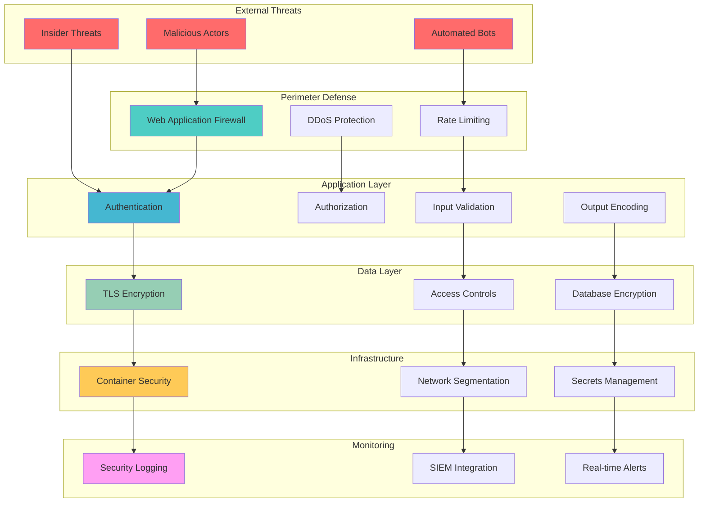

# SciFind Backend Security Guide

Comprehensive security guidelines, threat model, and mitigation strategies for the SciFind backend.

## Table of Contents
- [Security Overview](#security-overview)
- [Threat Model](#threat-model)
- [Authentication & Authorization](#authentication--authorization)
- [API Security](#api-security)
- [Data Protection](#data-protection)
- [Infrastructure Security](#infrastructure-security)
- [Provider Security](#provider-security)
- [Monitoring & Incident Response](#monitoring--incident-response)
- [Security Best Practices](#security-best-practices)
- [Compliance & Auditing](#compliance--auditing)
- [Security Checklist](#security-checklist)

## Security Overview

SciFind backend implements a defense-in-depth security strategy with multiple layers of protection:

1. **Perimeter Security**: API gateway with rate limiting and input validation
2. **Application Security**: Secure coding practices and dependency management
3. **Data Security**: Encryption at rest and in transit
4. **Infrastructure Security**: Container security and network isolation
5. **Operational Security**: Monitoring, logging, and incident response

### Security Architecture



## Threat Model

### Attack Vectors

#### 1. Web Application Attacks
- **SQL Injection**: Malicious SQL queries through input fields
- **Cross-Site Scripting (XSS)**: Injection of malicious scripts
- **Cross-Site Request Forgery (CSRF)**: Unauthorized actions on behalf of users
- **Input Validation Bypass**: Malformed data to bypass security controls

**Mitigations:**
- Parameterized queries with GORM ORM
- Input validation and sanitization
- Output encoding
- CSRF tokens for state-changing operations

#### 2. API Security Threats
- **Broken Authentication**: Weak or compromised authentication mechanisms
- **Broken Authorization**: Inadequate access controls
- **Sensitive Data Exposure**: Leaking of confidential information
- **Rate Limit Bypass**: Overwhelming the system with requests

**Mitigations:**
- Strong API key authentication
- Role-based access control (RBAC)
- Data encryption and masking
- Multi-layer rate limiting

#### 3. Infrastructure Attacks
- **Container Escape**: Breaking out of container isolation
- **Privilege Escalation**: Gaining unauthorized elevated access
- **Network Attacks**: Man-in-the-middle, eavesdropping
- **Supply Chain Attacks**: Compromised dependencies

**Mitigations:**
- Distroless container images
- Non-root user execution
- TLS encryption for all communications
- Dependency scanning and vulnerability management

#### 4. Data Breaches
- **Database Compromise**: Unauthorized access to stored data
- **Backup Exposure**: Insecure backup storage
- **Log Data Leakage**: Sensitive information in logs
- **Memory Dumps**: Extraction of data from memory

**Mitigations:**
- Database encryption at rest
- Secure backup procedures
- Log sanitization
- Memory protection techniques

### Risk Assessment Matrix

| Threat | Likelihood | Impact | Risk Level | Mitigation Priority |
|--------|------------|---------|------------|-------------------|
| SQL Injection | Low | High | Medium | High |
| API Key Compromise | Medium | High | High | High |
| DDoS Attack | High | Medium | High | High |
| Container Escape | Low | High | Medium | Medium |
| Data Exfiltration | Medium | High | High | High |
| Insider Threat | Low | High | Medium | Medium |

## Authentication & Authorization

### API Key Authentication

SciFind uses API key-based authentication for simplicity and performance:

#### Configuration
```yaml
security:
  api_keys:
    - "prod-key-1-$(openssl rand -hex 32)"
    - "prod-key-2-$(openssl rand -hex 32)"
  rate_limit:
    enabled: true
    requests: 1000
    window: "1m"
    burst_size: 50
```

#### Best Practices
- **Key Generation**: Use cryptographically secure random generation
- **Key Rotation**: Rotate keys regularly (recommended: every 90 days)
- **Key Storage**: Store keys in secure secret management systems
- **Key Transmission**: Only transmit over HTTPS

#### Implementation Example
```bash
# Generate secure API key
API_KEY=$(openssl rand -hex 32)

# Set in environment
export SCIFIND_SECURITY_API_KEYS="$API_KEY"

# Use in requests
curl -H "Authorization: Bearer $API_KEY" https://api.scifind.com/v1/search
```

### Authorization Model

Currently implements simple API key-based authorization. Future enhancements planned:

#### Role-Based Access Control (RBAC)
```yaml
# Future implementation
roles:
  reader:
    permissions: ["search:read", "papers:read"]
  admin:
    permissions: ["*"]
  researcher:
    permissions: ["search:*", "papers:read", "analytics:read"]
```

## API Security

### Input Validation

All API inputs are validated using Go's validator package:

```go
type SearchRequest struct {
    Query    string `json:"query" validate:"required,min=1,max=500"`
    Limit    int    `json:"limit" validate:"min=1,max=100"`
    Offset   int    `json:"offset" validate:"min=0"`
    Provider string `json:"provider" validate:"oneof=arxiv semantic_scholar exa tavily"`
}
```

### Rate Limiting

Multi-layered rate limiting protects against abuse:

#### Global Rate Limits
```yaml
security:
  rate_limit:
    enabled: true
    requests: 1000        # requests per window
    window: "1m"          # time window
    burst_size: 50        # burst allowance
```

#### Per-Endpoint Limits
```go
// Search endpoint: 100 req/min
// Health endpoint: No limit
// Admin endpoints: 10 req/min
```

#### Implementation
```go
// Rate limiting middleware
func RateLimitMiddleware(cfg RateLimitConfig) gin.HandlerFunc {
    limiter := rate.NewLimiter(rate.Every(time.Minute), cfg.BurstSize)
    return gin.HandlerFunc(func(c *gin.Context) {
        if !limiter.Allow() {
            c.JSON(429, gin.H{"error": "Rate limit exceeded"})
            c.Abort()
            return
        }
        c.Next()
    })
}
```

### Request/Response Security

#### Security Headers
```go
// Security middleware adds protective headers
func SecurityHeaders() gin.HandlerFunc {
    return func(c *gin.Context) {
        c.Header("X-Content-Type-Options", "nosniff")
        c.Header("X-Frame-Options", "DENY")
        c.Header("X-XSS-Protection", "1; mode=block")
        c.Header("Strict-Transport-Security", "max-age=31536000; includeSubDomains")
        c.Header("Content-Security-Policy", "default-src 'self'")
        c.Next()
    }
}
```

#### CORS Configuration
```yaml
security:
  cors:
    enabled: true
    allowed_origins: ["https://scifind.com", "https://app.scifind.com"]
    allowed_methods: ["GET", "POST", "PUT", "DELETE", "OPTIONS"]
    allowed_headers: ["Authorization", "Content-Type", "X-Request-ID"]
    max_age: "12h"
    credentials: false
```

## Data Protection

### Encryption in Transit

All communications use TLS 1.3:

#### TLS Configuration
```yaml
server:
  tls:
    enabled: true
    cert_file: "/etc/ssl/certs/scifind.crt"
    key_file: "/etc/ssl/private/scifind.key"
    min_version: "1.3"
    cipher_suites:
      - "TLS_AES_128_GCM_SHA256"
      - "TLS_AES_256_GCM_SHA384"
      - "TLS_CHACHA20_POLY1305_SHA256"
```

#### Certificate Management
```bash
# Generate certificate with Let's Encrypt
certbot certonly --standalone -d api.scifind.com

# Auto-renewal
0 0,12 * * * certbot renew --quiet
```

### Encryption at Rest

Database encryption protects stored data:

#### PostgreSQL Encryption
```sql
-- Enable transparent data encryption
ALTER SYSTEM SET ssl = on;
ALTER SYSTEM SET ssl_cert_file = 'server.crt';
ALTER SYSTEM SET ssl_key_file = 'server.key';

-- Column-level encryption for sensitive data
CREATE EXTENSION IF NOT EXISTS pgcrypto;

-- Encrypt sensitive fields
INSERT INTO papers (title, encrypted_content) 
VALUES ('Paper Title', pgp_sym_encrypt('sensitive content', 'encryption_key'));
```

#### Backup Encryption
```bash
# Encrypted database backup
pg_dump scifind | gpg --cipher-algo AES256 --compress-algo 1 --symmetric --output backup.sql.gpg

# Encrypted backup verification
gpg --decrypt backup.sql.gpg | head -10
```

### Data Classification

| Data Type | Classification | Protection Level | Retention |
|-----------|---------------|------------------|-----------|
| API Keys | Secret | Encrypt + Hash | 1 year |
| User Queries | Internal | Log sanitization | 90 days |
| Paper Metadata | Public | Standard encryption | Indefinite |
| System Logs | Internal | Encryption at rest | 1 year |
| Health Data | Internal | Standard encryption | 30 days |

### Privacy Protection

#### Data Minimization
- Collect only necessary data
- Anonymize personal information
- Regular data purging

#### Log Sanitization
```go
// Sanitize sensitive data from logs
func sanitizeLogData(data map[string]interface{}) map[string]interface{} {
    sensitiveFields := []string{"api_key", "password", "token", "secret"}
    
    for _, field := range sensitiveFields {
        if _, exists := data[field]; exists {
            data[field] = "[REDACTED]"
        }
    }
    
    return data
}
```

## Infrastructure Security

### Container Security

#### Distroless Base Images
```dockerfile
# Use distroless base image
FROM gcr.io/distroless/static:nonroot

# Run as non-root user
USER nonroot:nonroot

# Copy only necessary files
COPY --from=builder /app/scifind-backend /app/scifind-backend

# Set read-only filesystem
RUN chmod 755 /app/scifind-backend

ENTRYPOINT ["/app/scifind-backend"]
```

#### Security Context
```yaml
# Kubernetes security context
apiVersion: apps/v1
kind: Deployment
spec:
  template:
    spec:
      securityContext:
        runAsNonRoot: true
        runAsUser: 65534
        fsGroup: 65534
      containers:
      - name: scifind-backend
        securityContext:
          allowPrivilegeEscalation: false
          readOnlyRootFilesystem: true
          capabilities:
            drop:
            - ALL
          runAsNonRoot: true
          runAsUser: 65534
```

#### Container Scanning
```bash
# Scan container for vulnerabilities
trivy image scifind-backend:latest

# Continuous scanning in CI/CD
grype scifind-backend:latest --fail-on medium
```

### Network Security

#### Network Policies
```yaml
# Kubernetes network policy
apiVersion: networking.k8s.io/v1
kind: NetworkPolicy
metadata:
  name: scifind-network-policy
spec:
  podSelector:
    matchLabels:
      app: scifind-backend
  policyTypes:
  - Ingress
  - Egress
  ingress:
  - from:
    - podSelector:
        matchLabels:
          app: nginx-ingress
    ports:
    - protocol: TCP
      port: 8080
  egress:
  - to:
    - podSelector:
        matchLabels:
          app: postgres
    ports:
    - protocol: TCP
      port: 5432
```

#### Service Mesh Security
```yaml
# Istio security policy
apiVersion: security.istio.io/v1beta1
kind: PeerAuthentication
metadata:
  name: scifind-mtls
spec:
  selector:
    matchLabels:
      app: scifind-backend
  mtls:
    mode: STRICT
```

### Secrets Management

#### Kubernetes Secrets
```yaml
apiVersion: v1
kind: Secret
metadata:
  name: scifind-secrets
type: Opaque
stringData:
  api-key: "secure-api-key-here"
  db-password: "secure-db-password"
  semantic-scholar-key: "ss-api-key"
```

#### External Secret Management
```bash
# AWS Secrets Manager
aws secretsmanager create-secret \
  --name scifind/api-keys \
  --description "SciFind API keys" \
  --secret-string '{"semantic_scholar":"key","exa":"key"}'

# HashiCorp Vault
vault kv put secret/scifind \
  semantic_scholar_key="your-key" \
  exa_key="your-key"
```

## Provider Security

### API Key Management

Each external provider requires secure API key handling:

#### Configuration
```go
type ProviderConfig struct {
    APIKey      string `json:"api_key,omitempty" yaml:"api_key,omitempty"`
    APISecret   string `json:"api_secret,omitempty" yaml:"api_secret,omitempty"`
    Timeout     time.Duration
    MaxRetries  int
    RateLimit   RateLimitConfig
}
```

#### Secure Storage
```bash
# Store provider keys in environment variables
export SCIFIND_PROVIDERS_SEMANTIC_SCHOLAR_API_KEY="your-secure-key"
export SCIFIND_PROVIDERS_EXA_API_KEY="your-secure-key"
export SCIFIND_PROVIDERS_TAVILY_API_KEY="your-secure-key"
```

### Request Security

#### Request Signing
```go
func signRequest(req *http.Request, secret string) error {
    body, _ := io.ReadAll(req.Body)
    timestamp := strconv.FormatInt(time.Now().Unix(), 10)
    
    message := fmt.Sprintf("%s%s%s", timestamp, req.Method, string(body))
    mac := hmac.New(sha256.New, []byte(secret))
    mac.Write([]byte(message))
    signature := hex.EncodeToString(mac.Sum(nil))
    
    req.Header.Set("X-Timestamp", timestamp)
    req.Header.Set("X-Signature", signature)
    
    return nil
}
```

#### Circuit Breaker Security
```go
// Prevent cascade failures
circuit := &CircuitBreakerConfig{
    FailureThreshold: 5,
    Timeout:         60 * time.Second,
    MaxRequests:     10,
}
```

## Monitoring & Incident Response

### Security Monitoring

#### Security Events
```go
// Log security events
type SecurityEvent struct {
    Type        string    `json:"type"`
    Severity    string    `json:"severity"`
    Source      string    `json:"source"`
    Timestamp   time.Time `json:"timestamp"`
    Details     map[string]interface{} `json:"details"`
    RequestID   string    `json:"request_id"`
}

// Examples of monitored events
const (
    EventTypeAuthFailure      = "auth_failure"
    EventTypeRateLimitHit     = "rate_limit_hit"
    EventTypeSuspiciousQuery  = "suspicious_query"
    EventTypeUnauthorizedAccess = "unauthorized_access"
)
```

#### Alerting Rules
```yaml
# Prometheus alerting rules
groups:
- name: security_alerts
  rules:
  - alert: HighAuthFailureRate
    expr: rate(auth_failures_total[5m]) > 10
    for: 1m
    annotations:
      summary: "High authentication failure rate detected"
      
  - alert: RateLimitExceeded
    expr: rate_limit_exceeded_total > 100
    for: 30s
    annotations:
      summary: "Rate limit exceeded threshold"
      
  - alert: SuspiciousQuery
    expr: suspicious_query_total > 5
    for: 1m
    annotations:
      summary: "Suspicious search queries detected"
```

### Incident Response

#### Response Procedures

1. **Detection**: Automated monitoring alerts
2. **Assessment**: Evaluate threat severity and impact
3. **Containment**: Isolate affected systems
4. **Eradication**: Remove threat and vulnerabilities
5. **Recovery**: Restore normal operations
6. **Lessons Learned**: Post-incident review

#### Emergency Contacts
```yaml
incident_response:
  primary_oncall: "security@scifind.com"
  escalation_path:
    - "lead-engineer@scifind.com"
    - "cto@scifind.com"
  external_contacts:
    - "security-vendor@company.com"
```

#### Incident Playbooks

##### High Rate Limit Violations
1. Identify source IP/API key
2. Implement temporary rate limit reduction
3. Investigate query patterns
4. Block malicious sources
5. Monitor for continued abuse

##### Suspected Data Breach
1. Immediately isolate affected systems
2. Preserve evidence and logs
3. Assess data exposure scope
4. Notify stakeholders and authorities
5. Implement containment measures

## Security Best Practices

### Development Security

#### Secure Coding Guidelines

1. **Input Validation**
   ```go
   // Always validate and sanitize inputs
   func validateSearchQuery(query string) error {
       if len(query) == 0 {
           return errors.New("query cannot be empty")
       }
       if len(query) > 500 {
           return errors.New("query too long")
       }
       // Check for injection patterns
       if containsSQLInjection(query) {
           return errors.New("invalid characters in query")
       }
       return nil
   }
   ```

2. **Error Handling**
   ```go
   // Don't expose internal details
   func handleError(err error, c *gin.Context) {
       logger.Error("Internal error", "error", err)
       c.JSON(500, gin.H{
           "error": "Internal server error",
           "request_id": c.GetString("request_id"),
       })
   }
   ```

3. **Dependency Management**
   ```bash
   # Regular dependency updates
   go mod tidy
   go list -json -m all | nancy sleuth
   
   # Vulnerability scanning
   govulncheck ./...
   ```

### Operational Security

#### Security Configuration
```yaml
# Production security settings
security:
  api_keys: ["${SECURE_API_KEY_1}", "${SECURE_API_KEY_2}"]
  rate_limit:
    enabled: true
    requests: 1000
    window: "1m"
    burst_size: 50
  cors:
    enabled: true
    allowed_origins: ["https://scifind.com"]
    allowed_methods: ["GET", "POST"]
    credentials: false
  headers:
    x_frame_options: "DENY"
    x_content_type_options: "nosniff"
    x_xss_protection: "1; mode=block"
    strict_transport_security: "max-age=31536000; includeSubDomains"
```

#### Regular Security Tasks

**Daily:**
- Monitor security alerts
- Review authentication logs
- Check system resource usage

**Weekly:**
- Review access logs for anomalies
- Update security documentation
- Test backup and recovery procedures

**Monthly:**
- Rotate API keys
- Update dependencies
- Conduct security scans
- Review and update firewall rules

**Quarterly:**
- Security architecture review
- Penetration testing
- Incident response drill
- Security training updates

## Compliance & Auditing

### Audit Logging

```go
// Audit log structure
type AuditLog struct {
    Timestamp   time.Time `json:"timestamp"`
    RequestID   string    `json:"request_id"`
    UserID      string    `json:"user_id,omitempty"`
    Action      string    `json:"action"`
    Resource    string    `json:"resource"`
    Success     bool      `json:"success"`
    IP          string    `json:"ip_address"`
    UserAgent   string    `json:"user_agent"`
    Details     map[string]interface{} `json:"details,omitempty"`
}

// Log all API access
func auditMiddleware() gin.HandlerFunc {
    return func(c *gin.Context) {
        start := time.Now()
        c.Next()
        
        audit := AuditLog{
            Timestamp: start,
            RequestID: c.GetString("request_id"),
            Action:    c.Request.Method,
            Resource:  c.Request.URL.Path,
            Success:   c.Writer.Status() < 400,
            IP:        c.ClientIP(),
            UserAgent: c.Request.UserAgent(),
        }
        
        auditLogger.Info("API access", "audit", audit)
    }
}
```

### Compliance Standards

#### GDPR Compliance
- Data minimization principles
- Right to deletion implementation
- Privacy by design
- Data protection impact assessments

#### SOC 2 Compliance
- Access controls
- System monitoring
- Change management
- Incident response procedures

## Security Checklist

### Pre-Deployment Security Checklist

**Application Security:**
- [ ] Input validation implemented for all endpoints
- [ ] SQL injection protection verified
- [ ] XSS protection implemented
- [ ] CSRF protection for state-changing operations
- [ ] Error handling doesn't expose sensitive information
- [ ] Dependency vulnerabilities scanned and patched

**Authentication & Authorization:**
- [ ] Strong API key generation process
- [ ] API key rotation procedures documented
- [ ] Rate limiting configured and tested
- [ ] Authorization checks implemented for all endpoints

**Data Protection:**
- [ ] TLS 1.3 enabled for all communications
- [ ] Database encryption at rest configured
- [ ] Sensitive data properly classified and protected
- [ ] Backup encryption implemented
- [ ] Log sanitization implemented

**Infrastructure Security:**
- [ ] Container security scanning completed
- [ ] Non-root user execution configured
- [ ] Network policies implemented
- [ ] Secrets management properly configured
- [ ] Security contexts applied to all pods

**Monitoring & Incident Response:**
- [ ] Security monitoring implemented
- [ ] Alerting rules configured
- [ ] Incident response procedures documented
- [ ] Emergency contacts updated
- [ ] Log retention policies configured

### Production Security Checklist

**Ongoing Security Tasks:**
- [ ] Daily security alert monitoring
- [ ] Weekly access log review
- [ ] Monthly API key rotation
- [ ] Quarterly security assessments
- [ ] Annual penetration testing

## Security Contacts

For security issues or questions:
- **Security Team**: security@scifind.com
- **Emergency**: +1-XXX-XXX-XXXX
- **Bug Bounty**: security-reports@scifind.com

## Additional Resources

- [OWASP Top 10](https://owasp.org/www-project-top-ten/)
- [Go Security Guide](https://github.com/securego/gosec)
- [Container Security Best Practices](https://kubernetes.io/docs/concepts/security/)
- [API Security Best Practices](https://cheatsheetseries.owasp.org/cheatsheets/REST_Security_Cheat_Sheet.html)